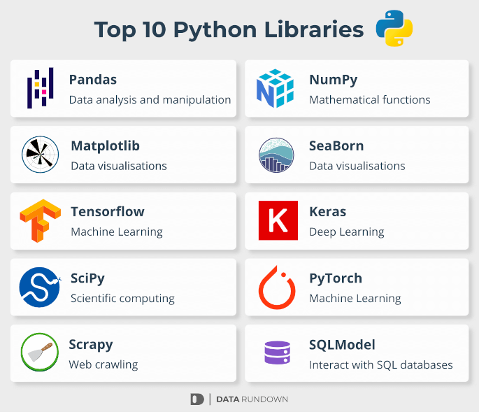
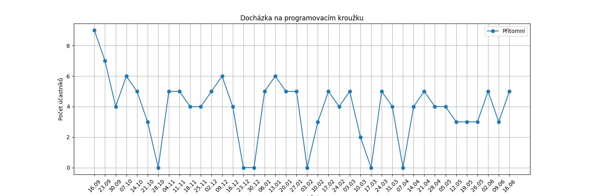
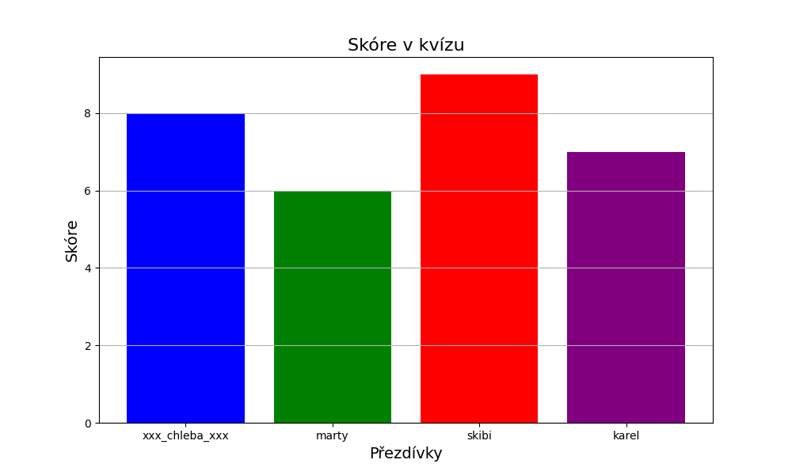
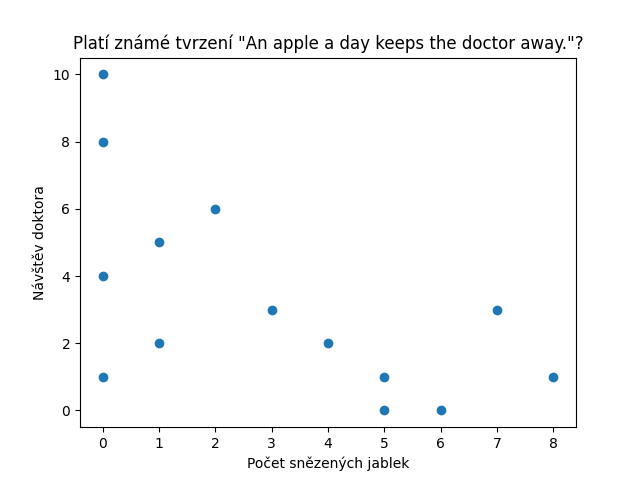

# Knihovny

Tato lekce slouží k seznámení se s pojmem **knihovna** v kontextu programování a k **vyzkoušení si pár vybraných Python knihoven.** 

**Řekneme si:**
  - co je to knihovna
  - jak fungují knihovny v Pythonu
  - jak používat příkaz **pip** k instalaci nových balíčků
  - ukázka některých nejpoužívanějších knihoven (co nejsou automaticky nainstalovány) + procvičení na příkladech
    - knihovna **PIL** pro práci s obrázky
    - knihovna **matplotlib** pro tvorbu grafů a vizualizaci dat



## Co je to knihovna

Knihovna je soubor nástrojů, funkcí a tříd, které byly vytvořeny tak, aby usnadnily a zrychlily programování.
Místo toho, abyste vytvářeli funkce od nuly, můžete využít již hotové knihovny.

Prostě někdo jiný naprogramoval nějaký užitečný kód, který dal ostatním lidem k používání. Nemá cenu vše programovat od začátku,
nějaké věci se prostě nemění, např. různé matematické funkce.


## Jak fungují knihovny v Pythonu

Python má obrovskou komunitu lidí, kteří vytváří knihovny pro různé účely. Vytvořit knihovnu může kdokoliv.
Dá se také podílet na zlepšování už existujících knihoven - například aby byly rychlejší, kód byl přehlednější atd.

### Import

Pokud chceme v našem kódu používat jakoukoliv knihovnu, musíme ji takzvaně **importovat**. **Import** je příkaz, který
se píše zpravidla na začátek souboru. Struktura příkazu je následující: `import nazev_knihovny`, kde `nazev_knihovny` je knihovna, kterou chceme používat.
Například pokud chceme generovat náhodná čísla, můžeme využít knihovnu `random`, a nemusíme tak vymýšlet způsob, jak generovat náhodná čísla.
Prostě použijeme funkce, které už naprogramoval někdo jiný a které jsou navíc ověřené rokama praxe.

```python
import random

# Generuje náhodné číslo mezi 1 a 10 (včetně obou koncových hodnot)
cislo = random.randint(1, 10)
print(cislo)

# Vrátí náhodný prvek z listu
ovoce = random.choice(['jablko', 'banán', 'kiwi'])
```

Často se také setkáte s použitím `from ... import ...`, což je příkaz, který slouží k tomu, chceme-li z nějaké knihovny vyzobnout jen něco. Například pokud víme, že z knihovny `random`
budeme používat jen některé funkce, mohli bychom výše ukázaný program napsat takto:

```python
from random import randint, choice

# Generuje náhodné číslo mezi 1 a 10 (včetně obou koncových hodnot)
cislo = randint(1, 10)
print(cislo)

# Vrátí náhodný prvek z listu
ovoce = choice(['jablko', 'banán', 'kiwi'])
```

To kód může učinit přehlednějším. Tím, že jsme importovali přímo konkrétní funkce z knihovny, nemusíme před každé volání psát `random.` .

## Instalace knihovny

Pokud chceme používat nějakou knihovnu, musíme si ji nejdříve nainstalovat. To však neplatí pro malou skupinu tzv. **standardních knihoven.**

### Standardní knihovny

V Pythonu existuje několik knihoven, které se nainstalují spolu s instalaci samotného Pythonu. To znamená, že pokud máte nainstalovaný Python, máte i tyto knihovny.

I přes to je však **musíme importovat, pokud je chceme používat.** Můžete se ptát, proč nejsou importovány automaticky. Je to z toho důvodu, že zbytečné
importování by vedlo k větší spotřebě paměti, zpoždění při spuštění programu, potenciální kolizi jmen atd.
Takže - pokud tyto knihovny chceme používat, musíme je importovat, ale nemusíme je instalovat.

**Příkladem těchto knihoven jsou**:
1. `random` - pro generování náhodných čísel a jiných náhodných operací
2. `datetime` - pro práci s daty a časem
3. `os` - pro interakci s operačním systémem
4. `math` - matematické funkce

## Jak nainstalovat knihovnu

### V Replitu

Instalace knihovny v Replitu je velmi jednoduchá:
1. **Otevřete panel "Packages"**: Na levé straně Replit editoru najdete ikonku balíčku (podobná symbolu škatulky). Klikněte na ni.
2. **Vyhledejte knihovnu**: Do vyhledávacího pole napište jméno knihovny, kterou chcete nainstalovat. Například, pokud chcete nainstalovat knihovnu matplotlib, zadejte "matplotlib" do vyhledávání.
3. **Instalace**: Jakmile najdete knihovnu, klikněte na tlačítko "Add". Tím se knihovna nainstaluje do vašeho Replit prostředí.
4. **Použijte knihovnu**: Jakmile je knihovna nainstalována, můžete ji začít používat ve svém kódu. Prostě ji importujte standardním způsobem.

Pokud se ale budete snažit použít knihovnu bez předchozí instalace, Replit to obvykle rozpozná a nabídne vám, že ji nainstaluje za vás.

### Lokálně

Pokud programujete lokálně, tzn. na vašem počítači (ne v internetovém IDE), tak se knihovny obvykle instalují příkazem `pip`, který se nainstaluje spolu s Pythonem, takže nemusíte nic dalšího stahovat.
`pip` je takový správce balíčků a knihoven.

Pokud si chcete nainstalovat novou knihovnu, otevřte si **Příkazový řádek** (Windows) nebo **Terminal** (Linux + Mac).
Následně napište `pip install nazev_knihovny`, kde `nazev_knihovny` je knihovna, kterou si přejete nainstalovat. Někdy 
budete muset použít příkaz `pip3` místo `pip` (kvůli verzím Pythonu).
Příkazem se dá dělat více věcí, např. upgradovat knihovny, odinstalovávat je či vypsat jejich seznam, atd.


# Pillow

Pillow je knihovna, která nám umožňuje pracovat s obrázky. Díky ní můžeme obrázky otevírat, měnit je, a pak je zase uložit. Můžeme například:
- zjistit informace o obrázku (šířka, výška...)
- měnit rozměry
- libovolně obrázek otáčet
- aplikovat filtry
- převádět mezi barevnými formáty
- a další

## Ukázka funkcí Pillow

V souboru [pillow-ukazka-funkci.py](pillow/pillow-ukazka-funkci.py) naleznete ukázku práci s `Pillow`. 
Soubor obsahuje načtení obrázku, následnou aplikaci nejrůznějších operací na něj a následné uložení.

Demonstraci práce s textem najdete pro přehlednost odděleně v souboru [pillow-prace-s-textem.py](pillow/pillow-prace-s-textem.py).

<p float="left">
  
   
</p>

Jelikož je `Pillow` velmi známá a rozšířená knihovna, můžete spoustu materiálu najít i na internetu, např. [tento skvělý zdroj](https://realpython.com/image-processing-with-the-python-pillow-library/). 
Skvělým pomocníkem pro tento typ práce vám může být i ChatGPT!

## Úlohy


### Meme Generátor

Cílem je vytvořit jednoduchý **Meme Generátor**, kde si uživatel může vybrat z předem připravených memes a následně do nich přidat vlastní text.

Ve složce `pillow/memes/` naleznete nějaké memes bez textu. Pokud chcete dát uživateli více možností, stáhněte sí více obrázků.

<div style="display: flex; justify-content: space-between;">
    <div style="flex: 1; margin-right: 1%;">
        
    </div>
    <div style="flex: 1; margin-right: 1%;">
        
    </div>
    <div style="flex: 1; margin-right: 1%;">
        
    </div>
    <div style="flex: 1; margin-right: 1%;">
        
    </div>
</div>


#### Jak na to

Je na vás, jak se rozhodnete úlohu pojmout, nebojte se experimentovat. 

Můžete začít programem, který bude umět pracovat jen s jedním konkrétním memem. Zeptáte se uživatele na text a umístíte ho na **správné místo do obrázku**.
Pro začátek bude stačit, když text umístíte na absolutní pozici. Souřadnice pozice, kam text budete umisťovat, zjistěte odhadem, pokus/omyl nebo si obrázek otevřte např. v Malování, kde si na pozici najeďte a souřadnice si opište.

Pokračovat můžete programem, který memů bude umět víc. Uživatel si na začátku zvolí meme a program se následně zeptá na text. Všimněte si, že každý meme bude potřebovat vlastní zacházení - text se v nich nachází na různých místech
a navíc jich může být rozdílný počet.

Zvažte následující funkcionality:
1. **Kontrola vstupu**
   - program by měl kontrolovat, že text není moc dlouhý
2. **Náhled**
    - program může umožňovat _náhled_ memu (pomocí příkazu `show`), aby uživatel nemusel meme opakovaně ukládat jen kvůli drobným úpravám


### Grafický editor

Udělejte jednoduchý **textový grafický editor**. Program by měl fungovat zhruba následovně:
1. **Uživatel zadá cestu k obrázku, který chce upravovat.**
2. **Program si obrázek načte.**
   - pokud danný obrázek neexistuje, proces se zopakuje
2. **Program opakovaně dává uživateli možnosti, co s obrázkem dělat.**
   - umístění textu (jaký a kam, případně barva/velikost)
   - rotace obrázku
   - změna velikosti
   - a další
3. **Až bude uživatel hotov, tak se program zeptá, kam má obrázek uložit a uloží výsledný obrázek.**

Pomocí příkazu `show` můžete uživateli průběžně zobrazovat náhled obrázku, aby viděl, jak aktuálně vypadá.

### Hledání cesty (soutěžní úloha)

TODO: Bude přidáno později.

# Matplotlib

Matplotlib je knihovna sloužící k **vytváření grafů** a **vizualizací** nad daty.
Obsahuje spousty různých druhů grafů, my si ukážeme ty nejzákladnější a nejvíce známé.

Použití je poměrně jednoduché, knihovna obsahuje několik funkcí, pomocí nichž se vše řídí a jsou společné pro většinu grafů.

**Vždy musíme:**
1. Zvolit **typ grafu**, který chceme použít.
2. Mít **data**, která chceme vizualizovat
    - v našem případě to budou vždy seznamy

## Typy grafů

### Čárový (spojnicový) graf

Čárový graf je dobrý na zobrazení **vývoje nějakého jevu v čase**.
Například vývoj ceny benzinu, počet nakažených chřipkou, cena dogecoinu...


Níže je vidět graf zobrazující účast na kroužku (2022/2023, 1. termín).
Na ose _x_ jsou jednotlivá data, kdy se kroužek konal (pátky). Na ose _y_ 
je pak počet účastníků. Čím výše čára je, tím více jich tam bylo.
Na první pohled lze vidět, kdy účastníků přišlo nejvíce.


Kód, který byl použit k vygenerování grafu najdete v souboru [matplotlib/1-carovy-graf.py](matplotlib/1-carovy-graf.py).

### Koláčový graf

Koláčový graf se používá k zobrazení procentuálního rozdělení jednotlivých kategorií.
Z grafu pak lze jednodušše vidět kolik si která kategorie z koláče "ukrojila".

Níže můžete vidět příklad koláčového grafu - v tomto případě se jedná o smyšlenou anketu o popularitě počítačových her.
Příslušný program je v souboru [matplotlib/2-kolacovy-graf.py](matplotlib/2-kolacovy-graf.py).


### Sloupcový graf

Sloupcové grafy jsou skvělé na srovnání hodnot mezi různými kategoriemi.
Na první pohled lze vidět kdo "vede" a jak velký je mezi sloupci rozdíl.

Následující graf zobrazuje skóre jednotlivých účastníků v kvízu (počet správně zodpovězených otázek). Kód najdete v souboru [matplotlib/3-sloupcovy-graf.py](matplotlib/3-sloupcovy-graf.py).


### Bodový graf

Bodový graf je dobrý na vizualizaci vztahu mezi dvěma proměnnými.
Graf tvoří jakousi plochu, kde podle jednotlivých bodů vidíme, jaké je rozložení dat a můžeme si udělat obrázek o vztahu zobrazovaných proměnných.
Pokud graf vypadá jako náhodná směs bodů, je větší šance, že spolu proměnné nijak nesouvisí.

Říká se, že **Kdo jablko denně sní, k tomu doktor nechodí** (anglicky _An apple a day keeps the doctor away._). Pojďme si ověřit, jestli je toto tvrzení pravdivé. 
Níže lze vidět graf, kde každý bod reprezentuje jednoho člověka. Kde v grafu se bod nachází je dáno:
1. **Kolik průměrně snědl za den jablek** (osa _x_)
2. **Kolikrát za poslední rok navštívil doktora** (osa _y_)

Zdrojový kód i data naleznete v souboru [matplotlib/4-bodovy-graf.py](matplotlib/4-bodovy-graf.py). Z pouhých dat (seznamů) na první pohled není nic moc vidět.
Když si ale uděláme graf, hned vidíme, že tvrzení nejspíš platí, protože počet návštěv doktora se zdá, že s rostoucím počtem snězených jablek denně **klesá**.



## Úlohy

Následující sekce obsahuje různá smyšlená i reálná data.
Vašim úkolem je udělat jejich vizualizaci. **Nejdříve si promyslete,
jaký typ grafu chcete použít,** a poté řešení naprogramujte.

### Cena skinu

**Zadání:** Ve hře _League of Legends_ často vycházejí nové skiny, které si hráči můžou kupovat za **RP**, což je herní měna, která se dá kupovat za reálné peníze.
Cena skinu se v čase může měnit. Vašim úkolem je udělat graf z následujících smyšlených dat, který vizualizuje jak se cena skinu měnila v čase. 

Z grafu by mělo jít na první pohled poznat:
  - jestli cena časem spíše klesá, nebo roste
  - kdy byl skin nejlevnější
  - kdy byl skin nejdražší

**Data o ceně skinu:**
```python
mesice = ["Leden", "Únor", "Březen", "Duben", "Květen", "Červen", "Červenec", "Srpen", "Září", "Říjen", "Listopad", "Prosinec"]
skin_cena = [2500, 2500, 2500, 2150, 2150, 750, 2150, 1650, 1650, 550, 1650, 1650]
```


### Lístky v tombole

**Zadání:** Vemte si data ze souboru, kde jsou zaznamenány lístky do tomboly a data nějakým vhodným způsobem vizualizujte. Nejspíše nejdřív budete muset udělat nějaké jejich předzpracování,
např. převést slovníky na seznamy, sečíst body atd. Z výsledného grafu by mělo být jasně vidět kolik má kdo bodů. 

Můžete použít následující data:
```python
osudi_1 = {"Petr": [3, 1, 2, 2, 3, 1, 1, 4, 3, 2, 2, 3, 4],
           "Pavel": [2, 1, 1, 1, 1, 1],
           "Kuba": [1, 3, 2, 2, 2, 3, 1, 1, 1, 1],
           "Martin": [3, 2, 3, 4, 3, 2, 3, 1, 3, 3, 1, 3, 3, 3, 2],
           "David": [2, 1, 1, 2, 5, 2, 2, 1]
           }
```

### Věk/výška

**Zadání:** Sesbírejte údaje o věku a výšce od lidí právě přítomných na kroužku. Sesbírané hodnoty si pak vložte do seznamu a vhodně vizualizujte tak, 
aby z grafu šlo poznat, jestli spolu věk a výška nějak souvisí.


### Vlastní graf

**Zadání:** Zvolte si nějaké téma a udělejte program, který vám vygeneruje náhodná data. Použijte knihovnu `random`. Data následně vizualizujte.
Program spusťte několikrát a přesvědčte se, že je graf pokaždé jiný. 
