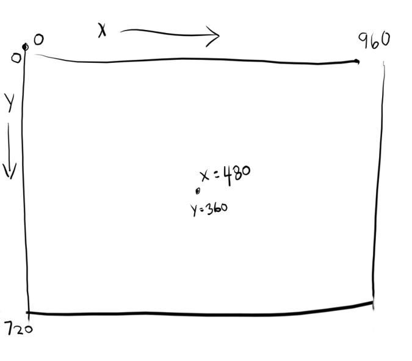
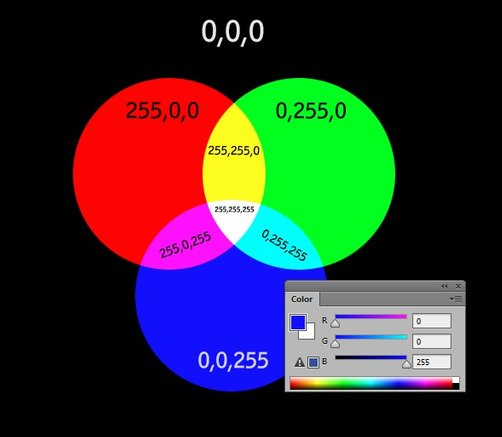

# PyGame tahák

Tento tahák nepředpokládá znalost objektového programování, proto jsou některé části ochuzené o hlubší vysvětlení.

## Obsah

1. [Základní pojmy](#základní-pojmy)
2. [Přidání čtverce/obdélníku](#přidání-čtverceobdélníku)
1. [Zobrazování textu](#zobrazování-textu)


## Základní pojmy

### Souřadnice



### Barvy



## Přidání čtverce/obdélníku

Čtverec/obdélník je nejjednodušší předmět, který do pygame můžeme přidat. O složitější objekty se začněte zajímat až ve chvíli, kdy perfektně ovládáte vytváření, vykreslování a kolizi obdélníků.

**Příklad:** Chceme udělat herní objekt — _jídlo_ —, které bude mít tvar čtverce. Následující kroky vysvětlují postup.

### 1) Pozice, barva, velikost

Nejprve je potřeba si určit tyto **3 základní vlastnosti**.
Nejlépe **si udělat proměnné pro každou z nich.**
Ano, pozice se může měnit, a to klidně i velikost a barva, což není problém, ale potřebujeme si udělat proměnné, kde budeme uchovávat aktuální hodnoty.
Ty můžeme změnit např. po stisku šipek atd.

Barvu či velikost jde často sdílet pro více herních objektů. Např. uděláte si barvu `ZELENA`,
kterou budete používat pro objekt `trava`, `list` i `zaba`, bez nutnosti dělat 3 různé proměnné. 


Tyto proměnné jsou většinou založené **před herním cyklem.**
```python
# POČÁTEČNÍ pozice pro jídlo (v průběhu hry můžem změnit)
pozice_x_jidlo = 200
pozice_y_jidlo = 200

# zelená barva, můžeme použít i pro jiné objekty 
ZELENA = (0, 255, 0)

# Velikost (pokud máme čtverec, stačí jedna proměnná = délka jedné hrany)
velikost_jidlo = 30
```
### 2) Sestavení a vykreslení čtverce/obdélníku

Když máme vlastnosti našeho objektu, stačí jej už pouze vytvořit pomocí `pygame.Rect`, což je něco jako funkce,
která přijímá 4 parametry a vrátí obdélník (**Rect**angle). Parametry jsou:
1. Souřadnice X
2. Souřadnice Y
3. Velikost jedné hrany (A)
4. Velkost druhé hrany (B)


```python
# Vytvoření Rectu
jidlo = pygame.Rect(pozice_x_jidlo, pozice_y_jidlo, velikost_jidlo, velikost_jidlo)
```
Poté, co máme Rect, jej stačí pomocí funkce `pygame.draw.rect` vykreslit do našeho okna.
```python
# 3 parametry - okno, barva a ten Rect
pygame.draw.rect(okno, YELLOW, jidlo)
```

## Kolize dvou čtverců/obdélníků

Často chceme zjistit, jestli do sebe dva obdélníky nenarazily (kolize).
Představme si, že máme dva obdélníky, `postava` a `jidlo`:

```python
# Rect pro postavu
postava = pygame.Rect(pozice_x_postava, pozice_y_postava, velikost_postava, velikost_postava)
# Rect pro jidlo
jidlo = pygame.Rect(pozice_x_jidlo, pozice_y_jidlo, velikost_jidlo, velikost_jidlo)
```

Jestli nastala kolize zjistíme následovně pomocí `colliderect`:

```python
if postava.colliderect(jidlo):
    # kolize nastala
    # zde můžeme zvyšit skóre, vygenerovat novou pozici jídla atd.
```

Šlo by to udělat i obráceně, tedy `jidlo.colliderect(postava)`. Je to něco jako funkce,
která vrací `True`, nebo `False`, podle toho, jestli do sebe danné dva Recty narazily.


## Zobrazování textu

Zobrazení jakéhokoliv textu v pygame se skládá z těchto kroků:
1. Výběr **fontu**
   - **font** udává jak bude písmo vypadat
   - na internetu je tisíce fontů volně ke stažení, některé jsou opravdu výživné
2. Načtení a nastavení fontu v pygame
3. Vytvoření textu
4. Vykreslení textu

### Výběr fontu

Musíte si vybrat a stáhnout nějaký **font**. Font udává styl písma.
Podívejte se na stránky https://fonts.google.com/ a vyberte si nějaký, který bude sedět pro váš účel.
Vybraný font si stáhněte.

Pokud je stažený soubor ve formátu ve formátu **zip** (nebo **rar**, **7z**, atd.) tak jej rozbalte. Cílem je 
získat **.ttf** soubor - tento soubor definuje vzhled každého písmena, tzn. to je to co chceme.

Sobor nahrajte na Replit (nebo přesuňte do vašeho PyCharm projektu), tak, aby ten **.ttf** soubor byl ve stejné složce jako vaše hra.

### Načtení a nastavení fontu v pygame

Když máte soubor s fontem ve vaší projektové složce, můžete jej načíst následovně:

```python
velikost = 36
font = pygame.font.Font('nazev_fontu.ttf', velikost)
```

Pro font si musíte zvolit velikost. Pokud chcete zobrazovat více textů různých velikostí
nebo různých fontů, musíte tento krok udělat vícekrát.

### Vytvoření textu

Nyní je potřeba vytvořit text, který budete chtít na obrazovce zobrazit.
První parametr je text, který chcete zobrazit, druhý parametr určuje, zda má být použit antialiasing (vyhlazování hran textu - dejte **True**),
a třetí parametr je barva textu.

Tento krok je podobný jako vytvoření **rectu** - uděláme objekt, ale ještě je potřeba ho vykreslit (o tom je další krok).

```python
WHITE = (255, 255, 255) # Bílá barva
text = font.render('Prohrál jsi! 🤡', True, WHITE)  
```

### Vykreslení textu

Vyvořený text vykreslíme pomocí metody **blit**.
První parametr je textový povrch (z předchozího kroku) a druhý parametr je pozice (x, y), kam chcete text vykreslit.

```python
okno.blit(text, (100, 100))  # Umístění textu na pozici (100, 100)
```