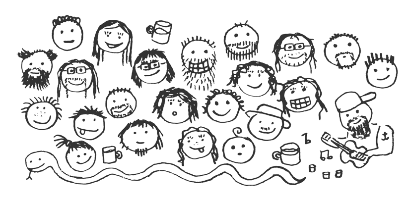

# Prográmko 2023/24 - Začátečníci

## Jak to na kroužku funguje

Prvních pár lekcí bude probíhat trochu "školním" způsobem. To znamená, že si vždy
**společně** projdeme nějaké téma a následně si jej procvičíte na příkládcích a úlohách.
Účast je tedy první měsíc obzvláště důležitá.

Postupně se však bude přecházet na **individuální výuku**. Každý bude moci
pracovat tempem, které mu vyhovuje. Témata se již nebudou vysvětlovat hromadně, ale jen
jedincům, kteří jsou v látce zrovna stejně daleko.
**Na nikoho se nemusí čekat a nikdo nebude nic zdržovat, protože to v tomto stylu výuky
prostě nejde.**

## Jak používat materiály

Na stránce https://github.com/Magmi183/programko/ jsou všechny doprovodné materiály, které na kroužku budeme používat.
Najdete tam různé složky a soubory, které jsou pravidelně aktualizované. Neustále jsou vylepšovány staré a přidávány nové materiály.

Vašim **výchozím bodem je složka** `Začátečníci`, která se nachází ve složce `VÝUKA`.
Při otevření této složky se vám automaticky zobrazí tento soubor, který právě čtete.

Odkazy na všechny materiály najdete v sekci **Osnova**, kde jsou popořadě vypsaná témata, která budeme probírat.
Ke každému tématu je připravený **doprovodný soubor**, který obsahuje ukázky látky. Tyto soubory nejsou určeny k samostudiu,
ale jako doprovodný materiál k mému výkladu, ikdyž se dají v omezeném režimu použít i samostatně.
Po uvedení do tématu budete programovat **Úlohy k procvičení**. Ke každému tématu je vypracovaná sbírka úloh.
Budete se snažit udělat jich co nejvíce, ale není potřeba vypracovat všechny.
Počet a typ úloh, které budete dělat, **domluvíme individuálně podle vašich potřeb a toho, co vás bude bavit.**

## Osnova

1. Seznámení se s příkazy **print** a **input**
    - interakce s uživatelem, seznámení se s konzolí, první Python program
    - [Doprovodný soubor k lekci](../../Témata/print_input/print_input.py)
    - [Úlohy k procvičení](../../Témata/print_input/ulohy.py)
2. **PROMĚNNÉ**
    - [Materiály](../../Témata/promenne/promenne.py)
    - [Úlohy k procvičení](../../Témata/promenne/ulohy_promenne.py)
3. **PODMÍNKY**
    - [Materiály](../../Témata/podminky/podminky.py)
    - [Úlohy k procvičení](../../Témata/podminky/ulohy_podminky.py)
4. **WHILE CYKLUS**
   - česky WHILE = DOKUD (dokud platí nějaká podmínka, dělej něco stále dokola)
   - [Materiály](../../Témata/while_cyklus/while_cyklus.py)
   - [Úlohy k procvičení](../../Témata/while_cyklus/ulohy.py)
5. **FOR CYKLUS**
   - česky FOR = PRO (např.: _pro_ každé písmeno ve slově, udělej...)
   - [Materiály](../../Témata/for_cyklus/for_cyklus.py)
   - [Úlohy k procvičení](../../Témata/for_cyklus/ulohy.py)
6. **SEZNAM**
   - [Materiály](../../Témata/seznam/seznam.py)
   - [Úlohy k procvičení](../../Témata/seznam/ulohy.py)
   - [Piškvorky (úloha na konec)](../../Témata/seznam/piskvorky/)
7. **ŽELVA**
   - procvičení nabytých znalostí grafickou formou pomocí nástroje Python turtle
   - [Materiály](../../Témata/zelva/zelva-navod.py)
   - [Úlohy k procvičení](../../Témata/zelva/ulohy.py)
8. **SOUBORY**
   - práce s **textovými** soubory
   - jednoduchá datová analýza (*data science!*)
   - [Materiály](../../Témata/soubory/soubory.py)
   - [Úlohy k procvičení](../../Témata/soubory/ulohy.py)

9. DALŠÍ TÉMATA BUDOU PŘIDÁNA V PRŮBĚHU
   - slovník, funkce ... 
   - (materiály jsou připravené ve složce `Témata`)
 